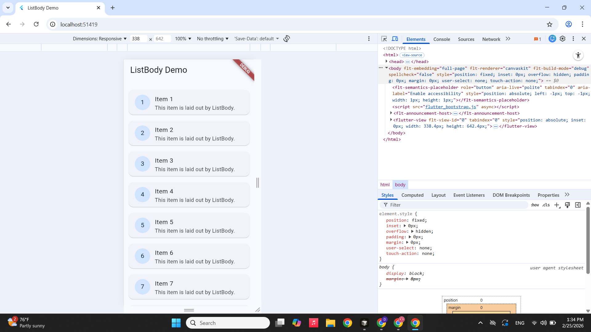

# ListBody Demo

A small Flutter app that demonstrates the `ListBody` widget by laying out a scrollable list of cards.

## Run instructions

**Prerequisite:** Flutter SDK installed and on your `PATH`.

```bash
flutter pub get
flutter run
```

Select a target device (Chrome, Windows, or a connected phone/emulator) when prompted.

## ListBody: the three key attributes

- **`mainAxis`**  Controls the direction in which the children are laid out, either `Axis.vertical` (default) or `Axis.horizontal`.  
- **`reverse`**  When `true`, reverses the order in which the children are painted along the main axis (e.g. bottomtotop instead of toptobottom).  
- **`children`**  The list of widgets that `ListBody` arranges sequentially along the main axis (in this app, eight `Card`/`ListTile` items).

## Screenshot




